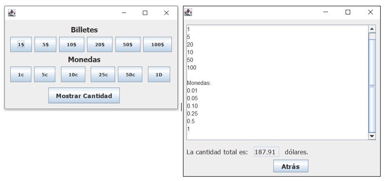

# MoneyCalculator
Ejemplos de calculadora de dinero (USD) mediante GUI.

Ejemplo donde a través de una interfaz gráfica se puede seleccionar de cualquier cantidad de billetes y monedas que circulan en el Ecuador, y una vez que se quiere se puede ver el total y todos los billetes y monedas seleccionados.
BigDecimal se utiliza para evitar errores al operar con dinero.

Example where through a graphical interface you can select from any amount of banknotes and coins circulating in Ecuador, and once you want you can view the total and all banknotes and coins selected.
BigDecimal is used to avoid errors when operating with money.

